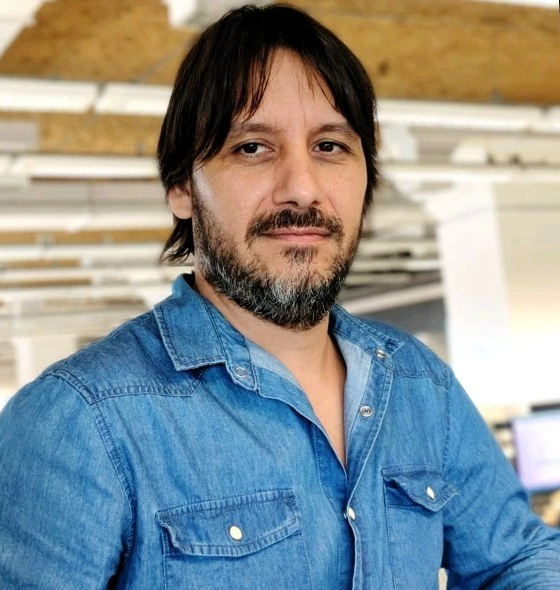

<!-- Tarjeta Principal de Perfil (Hero Bio Card) -->

<h1 class="profile-name">Mariano Imende</h1>

⚡ QA Automation &amp; Performance Lead

Quality Governance &bull; Mock-Driven Automation &bull; CI/CD KPIs &bull; High-Load Systems

<i class="fa-solid fa-gauge-high"></i> Performance
<i class="fa-solid fa-bolt"></i> K6 / JMeter
<i class="fa-solid fa-robot"></i> Playwright / Pytest
<i class="fa-solid fa-network-wired"></i> WireMock / OpenAPI
<i class="fa-solid fa-envelope"></i> Kafka / OpenShift

<!-- Métricas Clave (Stats Counter Grid) -->

+15

Años en Calidad de Software

+20 años de trayectoria en Red Link S.A.

&gt;1.700

RPS Validados

Cuenta DNI &bull; Sistemas de alta demanda

-60%

Tiempo de Regresión

Estrategia E2E pionera en la compañía

CoE

QA Practice Lead

Gobernanza, KPIs &amp; Formación técnica

<!-- Resumen Ejecutivo -->
<section class="cv-section">

<i class="fa-solid fa-user-tie section-icon"></i>
<h2 class="cv-section-title">Perfil Profesional</h2>

<strong>QA Automation &amp; Performance Lead</strong> con más de 15 años en calidad de software y más de una década liderando automatización y performance en sistemas críticos de alta demanda bancaria y transaccional.

Especializado en diseño e implementación de <strong>modelos de calidad organizacional</strong>, integrando automatización, pruebas de rendimiento continuo y prácticas avanzadas en entornos enterprise. Amplia experiencia liderando equipos técnicos, definiendo <strong>KPIs gerenciales</strong> y estableciendo marcos de gobernanza orientados a la mejora continua, el <em>Shift-Left testing</em> y la virtualización de servicios con <em>Mock-Driven Automation</em>.

</section>

<!-- Experiencia Profesional & Progresión de Carrera -->
<section class="cv-section">

<i class="fa-solid fa-building-columns section-icon"></i>
<h2 class="cv-section-title">Experiencia Profesional &bull; Red Link S.A.</h2>

<h3 class="company-name">Red Link S.A.</h3>
<i class="fa-solid fa-location-dot"></i> Buenos Aires, Argentina &bull; 2003 — Actualidad (+20 años)

Enterprise Fintech &amp; Banking

Progresión y liderazgo sostenido dentro del principal ecosistema de transacciones bancarias, pagos y billeteras digitales de Argentina.

<!-- Etapa: Especialista CoE -->

<i class="fa-solid fa-award"></i>

<h3 class="timeline-title">Especialista en Práctica QA (Modelo tipo CoE)</h3>
2022 — Actualidad

Estratégico / Gobernanza

Liderazgo en la gobernanza y transformación de la calidad en toda la organización. Diseño e impartición de talleres de capacitación técnica, desarrollo de frameworks corporativos y acompañamiento integral a testers funcionales para su transición hacia la automatización y el performance testing. Implementación de metodologías <em>Shift-Left</em> y <em>Contract-First</em> con especificaciones OpenAPI.

Gobernanza QA
Contract-First
Shift-Left
CoE Frameworks
Capacitación

<!-- Etapa: Supervisor Automatización y Performance -->

<i class="fa-solid fa-users-gear"></i>

<h3 class="timeline-title">Supervisor de Automatización y Performance</h3>
2017 — 2022 (5 años)

Liderazgo &amp; Gestión

Lideré durante 5 años consecutivos a un equipo de <strong>9 profesionales especializados</strong> en automatización, orquestación y pruebas de rendimiento. Definición de KPIs gerenciales, presentación de reportes ejecutivos a dirección y stakeholders, y administración de herramientas enterprise (ALM Octane, HP ALM, UFT Mobile, LoadRunner).

Team Leadership (9 pers.)
KPIs Gerenciales
ALM Octane
LoadRunner
GitLab CI

<!-- Etapa: QA Engineer -->

<i class="fa-solid fa-microchip"></i>

<h3 class="timeline-title">QA Engineer</h3>
2015 — 2017

Ingeniería Técnica

Diseño e implementación de suites de pruebas avanzadas, análisis de causa raíz de defectos y orquestación de pruebas en sistemas de alta criticidad (Home Banking, servidores de aplicaciones y bases de datos transaccionales).

<!-- Etapa: Automation Tester -->

<i class="fa-solid fa-robot"></i>

<h3 class="timeline-title">Automation Tester</h3>
2010 — 2015

Automatización E2E

Diseñé e implementé la <strong>primera estrategia de automatización End-to-End</strong> del ecosistema de la compañía, logrando una reducción del <strong>60% en los tiempos de regresión</strong> y sentando las bases del testing continuo.

<!-- Etapa: Tester Funcional -->

<i class="fa-solid fa-vial"></i>

<h3 class="timeline-title">Tester</h3>
2009 — 2010

Inicios en Calidad

Diseño y ejecución de casos de prueba funcionales para plataformas bancarias y de pagos electrónicos.

</section>

<!-- Principales Logros de Impacto -->
<section class="cv-section">

<i class="fa-solid fa-trophy section-icon"></i>
<h2 class="cv-section-title">Logros Clave de Impacto</h2>

<i class="fa-solid fa-gauge-high"></i>

<h4 class="achievement-title">Performance en Sistemas Críticos (> 1.700 RPS)</h4>

Ejecución de pruebas de rendimiento masivas en <strong>Cuenta DNI (Banco Provincia)</strong>, validando escenarios de más de <strong>1.700 peticiones por segundo (RPS)</strong> y contribuyendo directamente a optimizaciones clave de arquitectura e infraestructura.

<i class="fa-solid fa-bolt"></i>

<h4 class="achievement-title">Estrategia E2E Pionera (-60% en Regresión)</h4>

Creación e implantación del primer framework integral de pruebas automatizadas End-to-End de la compañía, reduciendo los tiempos de ciclos de regresión en un <strong>60%</strong> y aumentando la frecuencia de releases.

<i class="fa-solid fa-network-wired"></i>

<h4 class="achievement-title">Shift-Left &amp; Mock-Driven Automation</h4>

Implementación de generación anticipada de pruebas a partir de especificaciones <strong>OpenAPI</strong>, iniciando la validación de APIs desde etapas tempranas del ciclo de vida mediante contratos y servicios virtualizados con <strong>WireMock</strong>.

<i class="fa-solid fa-chart-line"></i>

<h4 class="achievement-title">KPIs Gerenciales &amp; Toma de Decisiones</h4>

Diseño e implementación de métricas de calidad y dashboards ejecutivos orientados a la toma de decisiones estratégicas, presentando resultados a gerencias y comités técnicos.

</section>

<!-- Matriz de Stack Técnico & Competencias -->
<section class="cv-section">

<i class="fa-solid fa-layer-group section-icon"></i>
<h2 class="cv-section-title">Stack Técnico &amp; Dominio de Industria</h2>

<i class="fa-solid fa-robot text-blue"></i>
<h4>Automatización E2E &amp; APIs</h4>

Playwright
Selenium
Pytest
Requests
Appium
WireMock
UFT

<i class="fa-solid fa-gauge-high text-cyan"></i>
<h4>Performance &amp; Stress Testing</h4>

k6
Apache JMeter
LoadRunner
VictoriaMetrics
Grafana

<i class="fa-solid fa-diagram-project text-green"></i>
<h4>CI/CD &amp; Quality Management</h4>

GitLab CI
ALM Octane
HP ALM
Quality Center
UFT Mobile

<i class="fa-solid fa-server text-purple"></i>
<h4>Infraestructura &amp; Plataforma</h4>

OpenShift
NGINX
WebLogic
Oracle DB
Docker

<i class="fa-solid fa-code text-cyan"></i>
<h4>Protocolos &amp; APIs</h4>

OpenAPI
REST
SOAP
Apache Kafka

<i class="fa-solid fa-landmark text-blue"></i>
<h4>Dominio de Industria</h4>

Banca Digital
Billeteras &amp; Pagos
Alta Criticidad
Enterprise

</section>

<!-- Competencias Clave -->
<section class="cv-section">

<i class="fa-solid fa-check-double section-icon"></i>
<h2 class="cv-section-title">Competencias Clave</h2>

<i class="fa-solid fa-check"></i> Gobernanza y transformación de QA

<i class="fa-solid fa-check"></i> Estrategia E2E &amp; API Testing

<i class="fa-solid fa-check"></i> Ingeniería de Performance (Alta Concurrencia)

<i class="fa-solid fa-check"></i> Contract-First &amp; Shift-Left Testing

<i class="fa-solid fa-check"></i> Integración en pipelines CI/CD

<i class="fa-solid fa-check"></i> Liderazgo y mentoría de equipos técnicos

<i class="fa-solid fa-check"></i> Análisis de causa raíz de defectos

<i class="fa-solid fa-check"></i> KPIs gerenciales y reporting ejecutivo

<i class="fa-solid fa-check"></i> Capacitación y transferencia de conocimiento

</section>

<!-- Formación Académica -->
<section class="cv-section">

<i class="fa-solid fa-graduation-cap section-icon"></i>
<h2 class="cv-section-title">Formación Académica &amp; Cursos</h2>

<h3 class="education-title">Analista Programador</h3>
ISFT N° 185 — Instituto Superior de Formación Técnica

Graduado 2003

<h4>🧪 Pruebas &amp; Automatización</h4>
<ul>
<li>ISTQB Certified Tester Foundation Level</li>
<li>Selenium con Java y Cucumber: El curso definitivo</li>
<li>Automation Tester Avanzado: REST Assured, Cucumber y Groovy</li>
<li>Planificación y Seguimiento de Pruebas de Software</li>
</ul>

<h4>🌐 Desarrollo &amp; Arquitectura</h4>
<ul>
<li>Java Advanced Programming: Threads, Networking, J2SE</li>
<li>Java Web: Servlets, JSP, JSTL, Struts &amp; AJAX</li>
<li>Node.js: Creando APIs con Express y MongoDB</li>
<li>Oracle PL/SQL &amp; Fundamentos de Bases de Datos</li>
<li>Desarrollo Seguro y Seguridad de la Información</li>
</ul>

<h4>🚀 Liderazgo Ágil &amp; Gestión</h4>
<ul>
<li>Programa de Desarrollo de Líderes &amp; El Líder como Coach</li>
<li>Liderazgo y Gestión de Equipos Ágiles</li>
<li>Planificación Agile con OKRs</li>
<li>Innovación y Design Thinking</li>
<li>Taller de Negociación Estratégica &amp; Feedback en Acción</li>
</ul>

</section>

<!-- Canales de Contacto Directo -->
<section class="cv-section">

<i class="fa-solid fa-paper-plane section-icon"></i>
<h2 class="cv-section-title">Canales de Contacto</h2>

<a href="mailto:imende.mariano@gmail.com" class="channel-card">

<i class="fa-solid fa-envelope"></i>

Email Directo
imende.mariano@gmail.com

</a>

<a href="https://linkedin.com/in/mariano-imende" target="_blank" rel="noopener noreferrer" class="channel-card">

<i class="fa-brands fa-linkedin-in"></i>

LinkedIn
/in/mariano-imende

</a>

<a href="https://github.com/MarianoImende" target="_blank" rel="noopener noreferrer" class="channel-card">

<i class="fa-brands fa-github"></i>

GitHub
github.com/MarianoImende

</a>

<a href="https://wa.me/5491162271394" target="_blank" rel="noopener noreferrer" class="channel-card">

<i class="fa-brands fa-whatsapp"></i>

WhatsApp
+54 9 11 6227-1394

</a>

</section>

